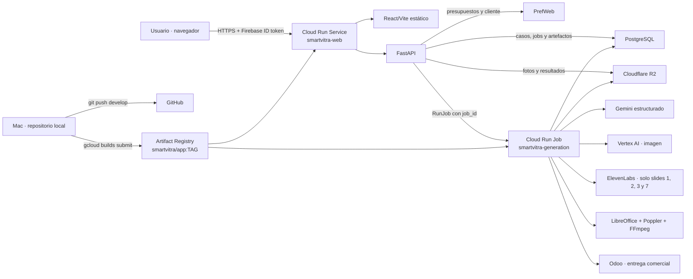
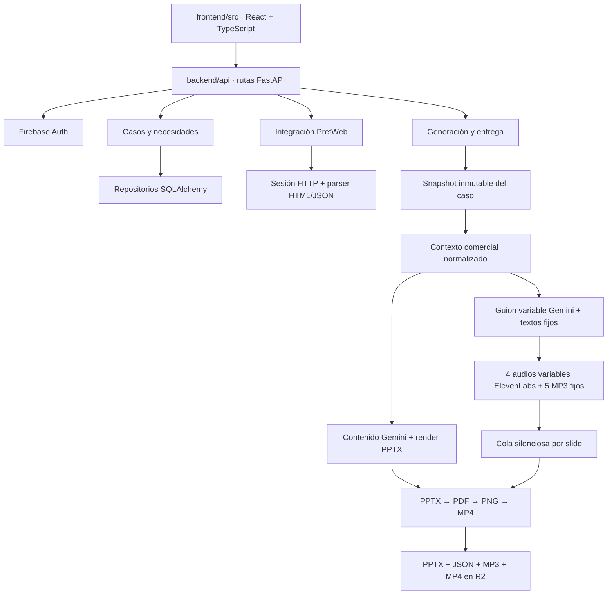

# Arquitectura de SmartVitra

Este documento describe la arquitectura que existe en el código y en producción a 5 de septiembre de 2026.

## Vista de sistemas

GitHub versiona el código, pero no ejecuta producción. Los dos componentes de Cloud Run usan normalmente la misma imagen Docker de Artifact Registry.

## Arquitectura de la aplicación

## Flujo funcional principal

1. El usuario inicia sesión mediante Firebase y busca/importa un presupuesto de PrefWeb.
2. `PrefWebService` obtiene el HTML detallado, la ficha actual del cliente y el resumen económico autoritativo. El descuento comercial se lee de las filas `Subtotal_Kind=6`; el subtotal y total finales proceden del resumen de PrefWeb.
3. El usuario completa el caso: necesidades, notas, fotos y selección de material visual.
4. La web crea un `GenerationJob` en PostgreSQL. `GenerationLauncher` ejecuta `smartvitra-generation` con el UUID del job.
5. El Job congela un snapshot, construye el contexto y genera la presentación.
6. Gemini redacta únicamente las slides variables 1, 2, 3 y 7. Las slides 4, 5, 6, 8 y 9 usan texto y MP3 versionados en el repositorio.
7. ElevenLabs sintetiza solo los cuatro fragmentos variables. Cada fragmento recibe 0,65 segundos de silencio final antes de calcular la duración de su slide.
8. LibreOffice convierte la presentación a PDF, Poppler crea las imágenes y FFmpeg monta vídeo y narración sin adelantar el cambio de slide.
9. Se guardan presentación, guion, narración y vídeo como artefactos. La API permite descargarlos y registrar su entrega.

## Despliegue

- Proyecto GCP: `project-c165bbbb-9f62-48fc-ba9`
- Región: `europe-west3`
- Web: `smartvitra-web`
- Job: `smartvitra-generation`
- Registro: `europe-west3-docker.pkg.dev/project-c165bbbb-9f62-48fc-ba9/smartvitra/app:TAG`
- Rama de trabajo: `develop`

La secuencia operativa está detallada en [PROJECT_OVERVIEW.md](PROJECT_OVERVIEW.md).
